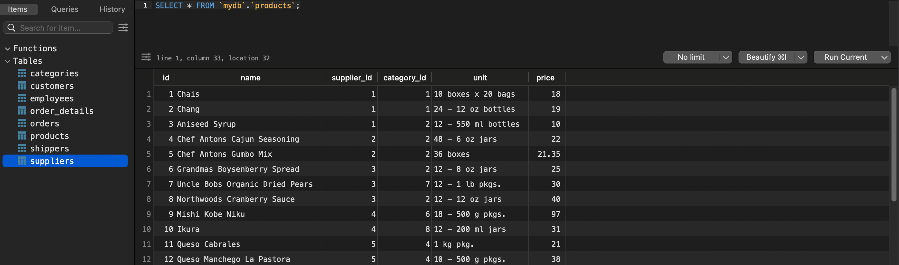
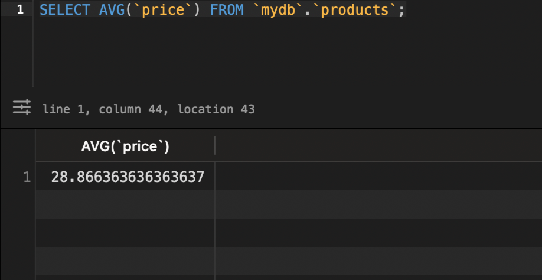
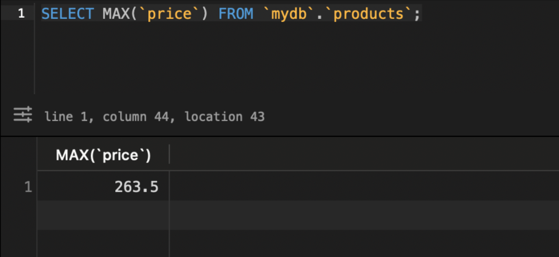
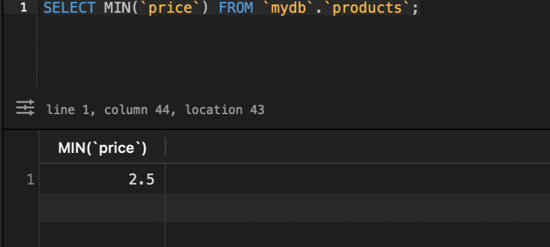
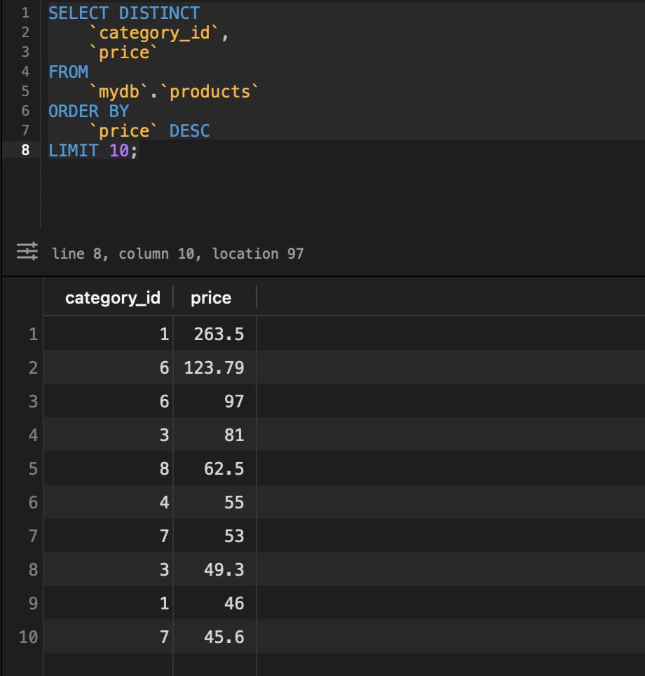

# goit-rdb-hw-03

## 1

Напишіть SQL команду, за допомогою якої можна

* вибрати всі стовпчики (За допомогою wildcard `*`) з таблиці _products_;
* вибрати тільки стовпчики _name_, _phone_ з таблиці _shippers_,

та перевірте правильність її виконання в MySQL Workbench.

### Відповідь 1

```sql
SELECT * FROM `mydb`.`products`;
SELECT `name`, `phone` FROM `mydb`.`shippers`;
```

---



## 2

Напишіть SQL команду, за допомогою якої можна знайти середнє, максимальне та мінімальне значення стовпчика _price_ таблички _products_, та перевірте правильність її виконання в MySQL Workbench.

### Відповідь 2

```sql
SELECT AVG(`price`) FROM `mydb`.`products`;
SELECT MAX(`price`) FROM `mydb`.`products`;
SELECT MIN(`price`) FROM `mydb`.`products`;
```

---




## 3

Напишіть SQL команду, за допомогою якої можна обрати унікальні значення колонок _category_id_ та _price_ таблиці _products_.

Оберіть порядок виведення на екран за спаданням значення _price_ та виберіть тільки 10 рядків. Перевірте правильність виконання команди в MySQL Workbench.

### Відповідь 3

```sql
SELECT DISTINCT `category_id`, `price` FROM `mydb`.`products` ORDER BY `price` DESC LIMIT 10;
```

---


## 4

Напишіть SQL команду, за допомогою якої можна знайти кількість продуктів (рядків), які знаходиться в цінових межах від 20 до 100, та перевірте правильність її виконання в MySQL Workbench.

## 5

Напишіть SQL команду, за допомогою якої можна знайти кількість продуктів (рядків) та середню ціну (_price_) у кожного постачальника (_supplier_id_), та перевірте правильність її виконання в MySQL Workbench.
